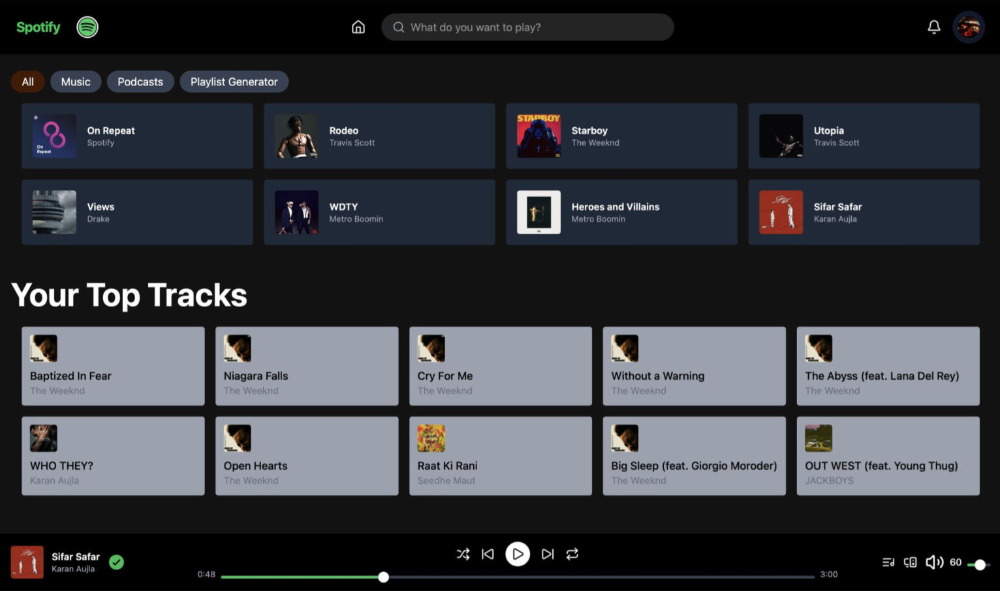

# Spotify Music Web App 



A full-stack music web application that connects with Spotify to analyze listening habits and generate smart playlists.

## Features

- **Top Artists** - View your most listened-to artists
- **Top Tracks** - See your favorite songs
- **Recently Played** - Track your recent listening history
- **Smart Playlist Generator** - Auto-creates playlists based on your listening habits
- **OAuth 2.0 Authentication** - Secure login via Spotify
- **Real-time Data** - Live rendering of your music data
- **Fully Responsive UI** - Sleek design that works on all devices

## Tech Stack

**Frontend**
- React + Vite
- Modern UI components

**Backend**
- Node.js + Express
- Spotify Web API integration
- OAuth 2.0 authentication

## Setup

1. Clone the repository
```bash
git clone https://github.com/Prateet-Github/spotify-music-app.git
cd spotify-music-app
```

2. Install dependencies
```bash
# Backend
cd backend
npm install

# Frontend
cd frontend
npm install
```

3. Configure Spotify API
- Create an app at [Spotify Developer Dashboard](https://developer.spotify.com/dashboard)
- Add your Client ID and Client Secret to `.env`:
```env
SPOTIFY_CLIENT_ID=your_client_id
SPOTIFY_CLIENT_SECRET=your_client_secret
REDIRECT_URI=http://localhost:5173/callback
```

4. Run the application
```bash
# Backend (port 5001)
cd backend
npm start

# Frontend (port 5173)
cd frontend
npm run dev
```

5. Open `http://localhost:5173` and login with Spotify

## How It Works

1. **Authentication** - User logs in via Spotify OAuth 2.0
2. **Data Fetching** - App retrieves user's listening data from Spotify API
3. **Analysis** - Smart algorithm analyzes listening patterns
4. **Playlist Generation** - Creates personalized playlists based on habits
5. **Real-time Updates** - Data refreshes automatically

## API Endpoints

| Endpoint | Description |
|----------|-------------|
| `/api/top-artists` | Get user's top artists |
| `/api/top-tracks` | Get user's top tracks |
| `/api/recent-tracks` | Get recently played songs |
| `/api/generate-playlist` | Create smart playlist |

## Skills Developed

- Full-stack development
- API integration and authentication flows
- OAuth 2.0 implementation
- Real-time data handling
- Modern deployment practices
- Responsive UI design

## License

Open source project.

---

Built with React, Node.js, Express, and Spotify Web API